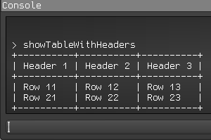
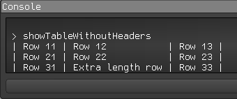
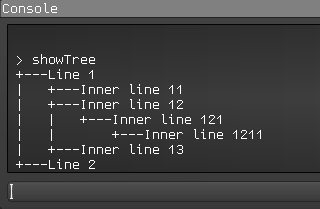

# libgdx-inGameConsole-utils

The libgdx-inGameConsole-utils is a utility library for StrongJoshua's [libgdx-inGameConsole](https://github.com/StrongJoshua/libgdx-inGameConsole) library.

## Including in Project

To use this library in your gradle project, add the version number and jitpack repository information to your root build.gradle file:

```groovy
allprojects {
    ext {
    	...
        inGameConsoleUtils = 'master-SNAPSHOT'
    }
    repositories {
	...
	maven { url 'https://jitpack.io' }
    }
}
```
And add the dependency in your core project:
```groovy
dependencies {
    implementation "com.github.Dgzt:libgdx-inGameConsole-utils:$inGameConsoleUtils"
}
```

## Usage

Create GUIConsole object with this library's skin:

```java
GUIConsole console = new GUIConsole(new Skin(Gdx.files.classpath("console_utils_skin/uiskin.json")));
```

### Table with headers



```java
ConsoleTable consoleTable = new ConsoleTable();

consoleTable.setHeaders("Header 1", "Header 2", "Header 3");
consoleTable.addRow("Row 11", "Row 12", "Row 13");
consoleTable.addRow("Row 21", "Row 22", "Row 23");

consoleTable.print(console);
```

### Table without headers



```java
ConsoleTable consoleTable = new ConsoleTable();

consoleTable.addRow("Row 11", "Row 12", "Row 13");
consoleTable.addRow("Row 21", "Row 22", "Row 23");
consoleTable.addRow("Row 31", "Extra length row", "Row 33");

consoleTable.print(console);
```

### Tree



```java
ConsoleTree consoleTree = new ConsoleTree();

TreeNode line1 = consoleTree.addRow("Line 1");
consoleTree.addRow(line1, "Inner line 11");
TreeNode line12 = consoleTree.addRow(line1, "Inner line 12");
TreeNode line121 = consoleTree.addRow(line12, "Inner line 121");
consoleTree.addRow(line121, "Inner line 1211");
consoleTree.addRow(line1, "Inner line 13");
consoleTree.addRow("Line 2");

consoleTree.print(console);
```
